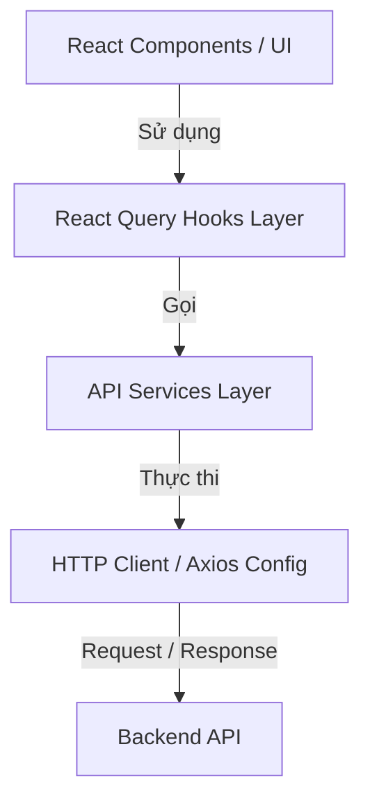

# Hướng dẫn thiết kế và viết API Client chuẩn theo dự án FranchisePlus

Tài liệu này hướng dẫn cách xây dựng, cấu trúc và viết API Client cho một dự án frontend sử dụng **React, TypeScript, Axios, và TanStack React Query** theo đúng kiến trúc chuẩn hóa của dự án `FranchisePlus`.

---

## 1. Tổng quan kiến trúc API (Architectural Flow)

Kiến trúc API được thiết kế tách biệt thành 4 lớp rõ rệt:



1.  **HTTP Client / Axios Config (`axios.config.ts`, `httpClient.api.ts`):** Thiết lập cơ chế gửi/nhận HTTP request, tự động định dạng payload, xử lý xoay vòng token refresh, xử lý lỗi chung.
2.  **API Services (`*.api.ts`):** Chứa các hàm gọi endpoints cụ thể của từng module (User, Product, Category,...), thực hiện ánh xạ dữ liệu (Data Mapping).
3.  **React Query Hooks (`use*.ts`):** Quản lý trạng thái cache dữ liệu (Server State), xử lý các tác vụ bất đồng bộ, invalidation cache sau khi cập nhật, và tích hợp hiển thị toast thông báo.
4.  **Types Layer (`*.type.ts`):** Phân chia rõ ràng giữa kiểu dữ liệu ở Client (Frontend) và Client nhận từ Server (Backend).

---

## 2. Bước 1: Thiết lập Core HTTP Client

Tạo cấu hình Axios trung tâm để tự động hóa các tác vụ liên lạc với Backend.

### 2.1. File `http.type.ts`
Chứa các interface chuẩn cho Request, Response và lớp quản lý lỗi `HttpError`.

```typescript
export interface HttpRequestConfig<
  TData = unknown,
  TParams extends Record<string, unknown> = Record<string, unknown>,
> {
  url: string;
  data?: TData;
  params?: TParams;
  headers?: Record<string, string>;
}

export interface ApiSuccessResponse<T> {
  success: true;
  data: T | null;
}

export interface ApiPaginatedResponse<T> {
  success: true;
  data: T[];
  pageInfo: {
    pageNum: number;
    pageSize: number;
    totalItems: number;
    totalPages: number;
  };
}

export interface ApiErrorItem {
  message: string;
  field?: string;
}

export class HttpError extends Error {
  status: number;
  code?: string;
  errors?: ApiErrorItem[];

  constructor(params: {
    status: number;
    message: string;
    code?: string;
    errors?: ApiErrorItem[];
  }) {
    super(params.message);
    this.status = params.status;
    this.code = params.code;
    this.errors = params.errors;
  }
}
```

### 2.2. File `axios.config.ts`
Chịu trách nhiệm:
1. Tự động convert **camelCase** (FE) $\leftrightarrow$ **snake_case** (BE) qua interceptors.
2. Tự động **Refresh Token** khi nhận lỗi `401 Unauthorized` có mã hết hạn token.

```typescript
import axios, { type InternalAxiosRequestConfig } from "axios";
import { HttpError } from "./http.type";
import { isPlainObject, mapKeys, mapValues, snakeCase, camelCase } from "lodash";

const API_URL = import.meta.env.VITE_API_URL;
const ACCESS_TOKEN_EXPIRED = "ACCESS_TOKEN_EXPIRED";

// Helper check object thường để transform case
const shouldTransform = (obj: unknown): boolean => {
  if (obj === null || typeof obj !== "object") return false;
  if (!isPlainObject(obj)) return false;
  return !(
    obj instanceof Date || obj instanceof File || obj instanceof Blob ||
    obj instanceof FormData || obj instanceof URLSearchParams
  );
};

const toCamel = <T>(obj: T): T => {
  if (Array.isArray(obj)) return obj.map((item) => toCamel(item)) as unknown as T;
  if (shouldTransform(obj)) {
    return mapKeys(
      mapValues(obj as Record<string, unknown>, (v) => toCamel(v)),
      (_, k) => camelCase(k)
    ) as unknown as T;
  }
  return obj;
};

const toSnake = <T>(obj: T): T => {
  if (Array.isArray(obj)) return obj.map((item) => toSnake(item)) as unknown as T;
  if (shouldTransform(obj)) {
    return mapKeys(
      mapValues(obj as Record<string, unknown>, (v) => toSnake(v)),
      (_, k) => snakeCase(k)
    ) as unknown as T;
  }
  return obj;
};

export const axiosClient = axios.create({
  baseURL: API_URL,
  withCredentials: true, // Bắt buộc để gửi/nhận Cookie (HttpOnly)
  timeout: 30000,
});

let isRefreshing = false;
let refreshQueue: { resolve: () => void; reject: (err: unknown) => void }[] = [];

const flushQueue = (error: unknown = null) => {
  refreshQueue.forEach(({ resolve, reject }) => (error ? reject(error) : resolve()));
  refreshQueue = [];
};

// 1. Request Interceptor (FE -> BE: camelCase to snake_case)
axiosClient.interceptors.request.use((config) => {
  if (config.data && !(config.data instanceof FormData)) {
    config.data = toSnake(config.data);
  }
  if (config.params) {
    config.params = toSnake(config.params);
  }
  return config;
});

// 2. Response Interceptor (BE -> FE: snake_case to camelCase & Auto Refresh Token)
axiosClient.interceptors.response.use(
  (response) => {
    if (response.data) response.data = toCamel(response.data);
    return response;
  },
  async (error) => {
    const originalRequest = error.config;
    if (!originalRequest || axios.isCancel(error)) return Promise.reject(error);

    if (!error.response) {
      throw new HttpError({
        status: 0,
        message: "Không thể kết nối đến máy chủ. Vui lòng kiểm tra kết nối mạng.",
        code: "ERR_NETWORK",
      });
    }

    if (error.response.data) {
      error.response.data = toCamel(error.response.data);
    }

    const status = error.response.status;
    const responseData = error.response.data;
    const errorCode = responseData?.errorCode ?? responseData?.message ?? null;

    const isTokenExpired = typeof errorCode === "string" && errorCode.endsWith(ACCESS_TOKEN_EXPIRED);

    // Xử lý 401 Unauthorized & Token Expired
    if (status === 401 && isTokenExpired && !originalRequest._retry) {
      originalRequest._retry = true;

      if (isRefreshing) {
        return new Promise<void>((resolve, reject) => {
          refreshQueue.push({ resolve, reject });
        }).then(() => axiosClient(originalRequest));
      }

      isRefreshing = true;

      try {
        // Dùng fetch native để tránh bị lặp vô hạn trong axios interceptor
        const refreshRes = await fetch(`${API_URL}/api/auth/refresh-token`, {
          method: "GET",
          credentials: "include",
          cache: "no-store",
        });

        if (!refreshRes.ok) throw new Error("Refresh token failed");

        flushQueue();
        return axiosClient(originalRequest);
      } catch (refreshErr) {
        flushQueue(refreshErr);
        // Logout user và đẩy về trang login
        window.location.replace("/login");
        throw new HttpError({
          status: 401,
          message: "Phiên đăng nhập đã hết hạn, vui lòng đăng nhập lại.",
          code: "REFRESH_TOKEN_FAILED",
        });
      } finally {
        isRefreshing = false;
      }
    }

    throw new HttpError({
      status,
      message: responseData?.message ?? "Đã xảy ra lỗi.",
      code: errorCode,
      errors: responseData?.errors,
    });
  }
);
```

### 2.3. File `httpClient.api.ts`
Cung cấp các hàm wrapper tiện ích cho các phương thức HTTP.

```typescript
import { axiosClient } from "./axios.config";
import type { HttpRequestConfig, ApiSuccessResponse, ApiPaginatedResponse } from "./http.type";

const cleanParams = (params?: Record<string, unknown>) => {
  if (!params) return undefined;
  const cleaned: Record<string, unknown> = {};
  Object.keys(params).forEach((key) => {
    const val = params[key];
    if (val !== "" && val !== undefined && val !== null) {
      cleaned[key] = val;
    }
  });
  return cleaned;
};

export const httpClient = {
  async get<T>(config: HttpRequestConfig<never>): Promise<T | null> {
    const res = await axiosClient.get<ApiSuccessResponse<T>>(config.url, {
      params: cleanParams(config.params),
      headers: config.headers,
    });
    return res.data.data;
  },

  async post<T, D>(config: HttpRequestConfig<D>): Promise<T | null> {
    const res = await axiosClient.post<ApiSuccessResponse<T>>(config.url, config.data, {
      headers: config.headers,
    });
    return res.data.data;
  },

  // Bypass interceptor bằng cách truyền raw JSON string (để giữ nguyên camelCase cho Backend mong muốn)
  async postRaw<T, D>(config: HttpRequestConfig<D>): Promise<T | null> {
    const res = await axiosClient.post<ApiSuccessResponse<T>>(
      config.url,
      JSON.stringify(config.data),
      {
        headers: { "Content-Type": "application/json", ...config.headers },
      }
    );
    return res.data.data;
  },

  async put<T, D>(config: HttpRequestConfig<D>): Promise<T | null> {
    const res = await axiosClient.put<ApiSuccessResponse<T>>(config.url, config.data, {
      headers: config.headers,
    });
    return res.data.data;
  },

  async delete<T>(config: HttpRequestConfig<never>): Promise<T | null> {
    const res = await axiosClient.delete<ApiSuccessResponse<T>>(config.url, {
      params: cleanParams(config.params),
      headers: config.headers,
    });
    return res.data.data;
  },
};
```

---

## 3. Bước 2: Tạo API Service cho Từng Module

Mỗi thực thể (Entity) như `Product`, `User`, `Category` sẽ có một thư mục riêng trong `src/api/`.

### 3.1. Thiết lập Interface & Mapping (ví dụ `category.api.ts`)
Khi viết API Service, bạn cần thực hiện:
1. Định nghĩa kiểu API raw từ Backend trả về (`ApiCategory` chứa `snake_case`).
2. Định nghĩa kiểu Client FE sử dụng (`Category` chứa `camelCase`).
3. Viết hàm mapper để chuyển đổi từ `ApiCategory` sang `Category`.

```typescript
import type { Category } from "@/types/category"; // Định nghĩa kiểu Client sử dụng
import { httpClient } from "../httpClient.api";

// 1. Raw API Response interface từ Backend (snake_case)
export interface ApiCategory {
  id: string;
  category_code: string;
  category_name: string;
  is_active: boolean;
  created_at: string;
}

// 2. Client Request interfaces
export interface CreateCategoryRequest {
  categoryCode: string;
  categoryName: string;
}

export interface CategorySearchRequest {
  keyword: string;
  isActive: boolean | "";
}

// 3. Mapper Function
export const mapApiCategory = (raw: ApiCategory): Category => ({
  id: raw.id,
  categoryCode: raw.category_code,
  categoryName: raw.category_name,
  isActive: raw.is_active,
  createdAt: raw.created_at,
});

// 4. API Functions
export const searchCategories = async (params: CategorySearchRequest): Promise<Category[]> => {
  const response = await httpClient.get<ApiCategory[]>({
    url: "/api/categories",
    params: params as any, // axiosClient tự động convert params sang snake_case
  });
  return (response ?? []).map(mapApiCategory);
};

export const createCategory = async (data: CreateCategoryRequest): Promise<Category> => {
  const response = await httpClient.post<ApiCategory, CreateCategoryRequest>({
    url: "/api/categories",
    data, // axiosClient tự động convert payload sang snake_case
  });
  if (!response) throw new Error("Không có phản hồi từ máy chủ");
  return mapApiCategory(response);
};

export const deleteCategory = async (id: string): Promise<void> => {
  await httpClient.delete<void>({
    url: `/api/categories/${id}`,
  });
};
```

---

## 4. Bước 3: Tạo React Query Hooks Layer

Lớp Hook đóng vai trò làm cầu nối giữa UI Component và API Service, đồng thời quản lý Cache & Side-effects.

### 4.1. File `useCategoryQuery.ts` (ví dụ)
Nên đặt file hooks này trong `src/hooks/category/useCategoryQuery.ts`.

```typescript
import { useQuery, useMutation, useQueryClient, keepPreviousData } from "@tanstack/react-query";
import { toast } from "sonner";
import * as categoryApi from "@/api/category/category.api";
import type { CategorySearchRequest, CreateCategoryRequest } from "@/api/category/category.api";

// Cấu trúc khóa cache tập trung
const CATEGORY_KEYS = {
  all: ["categories"] as const,
  search: (params: CategorySearchRequest) => ["categories", "search", params] as const,
  detail: (id: string) => ["categories", "detail", id] as const,
};

// Hook lấy danh sách Category (Query)
export const useCategoriesQuery = (params: CategorySearchRequest) => {
  return useQuery({
    queryKey: CATEGORY_KEYS.search(params),
    queryFn: () => categoryApi.searchCategories(params),
    placeholderData: keepPreviousData, // Giữ lại UI cũ trong lúc tải trang mới
  });
};

// Hook tạo mới Category (Mutation)
export const useCreateCategoryMutation = () => {
  const queryClient = useQueryClient();

  return useMutation({
    mutationFn: (data: CreateCategoryRequest) => categoryApi.createCategory(data),
    onSuccess: () => {
      // Refresh lại cache để các Component dùng chung nhận diện được dữ liệu mới
      queryClient.invalidateQueries({ queryKey: CATEGORY_KEYS.all });
      toast.success("Tạo danh mục thành công!");
    },
    onError: (error: any) => {
      toast.error("Lỗi tạo danh mục", {
        description: error.message || "Vui lòng thử lại sau.",
      });
    },
  });
};

// Hook xóa Category (Mutation)
export const useDeleteCategoryMutation = () => {
  const queryClient = useQueryClient();

  return useMutation({
    mutationFn: (id: string) => categoryApi.deleteCategory(id),
    onSuccess: () => {
      queryClient.invalidateQueries({ queryKey: CATEGORY_KEYS.all });
      toast.success("Xóa danh mục thành công!");
    },
    onError: (error: any) => {
      toast.error("Lỗi xóa danh mục", {
        description: error.message,
      });
    },
  });
};
```

---

## 5. Quy tắc & Lưu ý Quan Trọng Khi Code API Cho Dự Án Mới

> [!IMPORTANT]
> **Quy tắc về Kiểu chữ (Case Naming):**
> *   Dữ liệu chạy bên trong React component và hooks **luôn luôn là `camelCase`**.
> *   Không bao giờ viết trực tiếp key dạng `snake_case` ở phía UI. Hãy để interceptor chuyển đổi tự động hoặc thực hiện mapping tại hàm service.

> [!WARNING]
> **Vấn đề Bypass Interceptor:**
> *   Nếu Backend có một số endpoint đặc biệt viết không đồng nhất (yêu cầu gửi camelCase hoặc nhận snake_case không thể convert tự động), hãy viết một Axios instance riêng cho file đó (như `product.api.ts` đã làm) hoặc dùng hàm bypass `httpClient.postRaw(...)`.

> [!TIP]
> **Tối ưu hóa Server State với React Query:**
> *   Luôn khai báo query key có cấu trúc phân cấp (ví dụ: `["categories", "detail", id]`). Khi xóa hoặc thay đổi, bạn có thể dễ dàng invalidate toàn bộ nhóm key bằng `["categories"]`.
> *   Sử dụng `keepPreviousData` đối với các Query có phân trang để cải thiện trải nghiệm người dùng tối đa.
