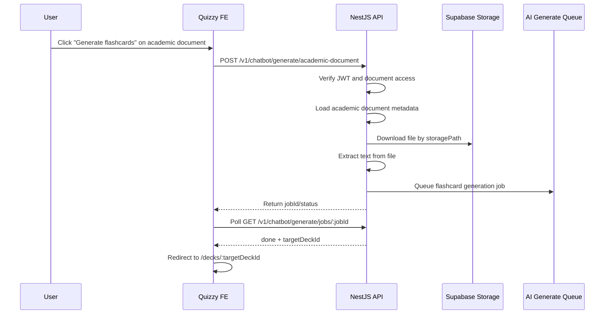

# Academic Document → AI Flashcard Generation Plan

## Goal

Allow users to generate flashcard decks directly from files already stored in the Academic Documents module.

Instead of making the frontend download a Supabase file and upload it again to the chatbot endpoint, the frontend should only send an `academicDocumentId`. The backend will verify access, fetch the file from storage, extract text, then reuse the existing AI generation pipeline to create a deck and cards.

## Why This Is The Preferred Approach

The current AI Tutor can generate flashcards from uploaded PDFs through:

```http
POST /v1/chatbot/generate/pdf
```

However, Academic Documents already stores file metadata and storage paths. Re-uploading from FE is weaker because:

- Browser `fetch(fileUrl)` can fail because of CORS or public URL restrictions.
- The frontend has to download then upload the same file again.
- Access control is split between FE behavior and Supabase public URLs.
- Non-PDF support becomes messy in the browser.

The backend-driven flow is cleaner:

- FE sends only `documentId`.
- BE checks user auth and document access.
- BE fetches the file using trusted server credentials.
- BE extracts content using server libraries.
- Existing chatbot job queue creates deck/cards.
- FE polls the same generate job endpoint.

## Proposed User Flow



## Backend API Contract

### Generate From Academic Document

```http
POST /v1/chatbot/generate/academic-document
Authorization: Bearer <accessToken>
Content-Type: application/json
```

Request:

```json
{
  "documentId": "academicDocumentId",
  "title": "Optional deck title",
  "cardCount": 10,
  "difficulty": "medium",
  "language": "vi",
  "conversationId": "optionalConversationId"
}
```

Response:

```json
{
  "success": true,
  "data": {
    "jobId": "aiGenerationJobId",
    "sourceId": "aiSourceId",
    "bullJobId": "queueJobId",
    "status": "queued"
  }
}
```

Validation rules:

- `documentId`: required, valid Mongo ObjectId.
- `title`: optional, default to document title.
- `cardCount`: optional, integer from `5` to `30`.
- `difficulty`: optional, one of `easy | medium | hard`.
- `language`: optional, default `vi`.
- `conversationId`: optional, must belong to current user if provided.

## Backend Implementation Plan

### 1. Add DTO

Create a DTO similar to existing text/pdf generation DTOs:

```ts
export class GenerateFlashcardsAcademicDocumentDto {
  documentId: string;
  title?: string;
  cardCount?: number;
  difficulty?: "easy" | "medium" | "hard";
  language?: string;
  conversationId?: string;
}
```

Recommended location in backend:

```txt
src/modules/chatbot/dto/generate-flashcards-academic-document.dto.ts
```

### 2. Add Controller Endpoint

Add to chatbot controller:

```ts
@Post("generate/academic-document")
async generateFromAcademicDocument(
  @CurrentUser() user: JwtUser,
  @Body() dto: GenerateFlashcardsAcademicDocumentDto,
) {
  return this.chatbotService.generateFromAcademicDocument(user.id, dto);
}
```

### 3. Load And Authorize Academic Document

Backend should query the Academic Documents collection by `documentId`.

Checks:

- Document exists.
- Document status is `active`.
- User can access the document.
- File type is supported.

For first implementation, support only:

```txt
pdf
```

Later:

```txt
docx, pptx, xlsx
```

### 4. Download File Server-Side

Prefer downloading through `storagePath` instead of public `fileUrl`.

Example service responsibility:

```ts
const fileBuffer = await academicStorageService.download(document.storagePath);
```

Recommended backend env:

```env
SUPABASE_URL=...
SUPABASE_SERVICE_ROLE_KEY=...
SUPABASE_ACADEMIC_BUCKET=academic-documents
```

Important: never expose `SUPABASE_SERVICE_ROLE_KEY` to frontend.

### 5. Extract Text

For PDF:

```txt
pdf-parse
```

For future formats:

```txt
docx: mammoth
pptx: officeparser or custom extraction
xlsx: xlsx
```

Minimum extraction output:

```ts
{
  extractedText: string;
  pageCount?: number;
  metadata?: Record<string, unknown>;
}
```

Validation:

- Reject empty extraction.
- Reject too-large extracted text or truncate safely to the same limit as text generation, currently `50,000` characters.
- Store extraction error in job/source metadata when possible.

### 6. Reuse Existing AI Source + Job Flow

The new academic-document endpoint should create an AI source like:

```ts
{
  type: "academic_document",
  title: dto.title ?? document.title,
  fileUrl: document.fileUrl,
  storagePath: document.storagePath,
  academicDocumentId: document._id,
  extractedText,
  status: "ready"
}
```

Then create the generation job using the same queue already used by:

```http
POST /v1/chatbot/generate/text
POST /v1/chatbot/generate/pdf
```

The queue processor should not care whether the source came from pasted text, uploaded PDF, or academic document. It only needs extracted text and options.

### 7. Create Deck Metadata

Generated deck should include enough metadata to trace the source:

```ts
{
  title: dto.title ?? document.title,
  description: `Generated from academic document: ${document.title}`,
  sourceType: "ai",
  tags: ["ai-generated", "academic", document.fileType, subject.code]
}
```

If the backend supports deck metadata/source references, include:

```ts
{
  academicDocumentId: document._id,
  aiSourceId: source._id,
  subjectId: document.subjectId
}
```

## Frontend Implementation Plan

### 1. Add API Method

Extend `src/services/api/chatbot.api.ts`:

```ts
export interface GenerateFromAcademicDocumentInput {
  documentId: string;
  title?: string;
  cardCount?: number;
  difficulty?: FlashcardDifficulty;
  language?: string;
  conversationId?: string;
}

generateFromAcademicDocument: (data: GenerateFromAcademicDocumentInput) =>
  apiClient.post<ApiResponse<GenerateQueuedJob>>(
    "/chatbot/generate/academic-document",
    data,
  );
```

### 2. Add UI Action In Academic Document Table

In Academic Documents table:

- Keep existing `Download`.
- Add `Generate flashcards`.
- Enable initially for `pdf`.
- Disable for `docx/pptx/xlsx/other` until backend extractors are ready.

Button behavior:

```ts
generateAcademicMutation.mutate({
  documentId: document._id,
  title: document.title,
  cardCount: 10,
  difficulty: "medium",
  language: "vi",
});
```

### 3. Poll Job

Reuse the AI Tutor polling pattern:

```ts
GET /v1/chatbot/generate/jobs/:jobId
```

When status is:

- `queued`: show queued state.
- `running`: show generating state.
- `done`: redirect to `/decks/${targetDeckId}`.
- `failed`: show error and allow retry.

### 4. Optional Modal

Before starting generation, show a small modal:

Fields:

- Deck title.
- Card count.
- Difficulty.
- Language.

Defaults:

```txt
title: document.title
cardCount: 10
difficulty: medium
language: vi
```

## Data Model Additions

If backend schemas can be extended, add these optional fields.

### AiSource

```ts
type: "text" | "pdf" | "academic_document";
academicDocumentId?: ObjectId;
subjectId?: ObjectId;
storagePath?: string;
fileUrl?: string;
fileType?: string;
extractedText?: string;
```

### AiGenerationJob

```ts
sourceType?: "text" | "pdf" | "academic_document";
academicDocumentId?: ObjectId;
```

### Deck

```ts
aiSourceId?: ObjectId;
academicDocumentId?: ObjectId;
sourceType: "manual" | "ai";
```

## Security Requirements

- Endpoint must require JWT.
- Never trust `fileUrl` sent from FE.
- FE sends `documentId` only.
- BE loads document metadata from database.
- BE verifies document access before downloading file.
- BE downloads using service role or trusted storage credentials.
- Rate limit this endpoint like other AI generation endpoints.
- Validate file type and file size server-side.
- Store extraction/generation errors without leaking service secrets.

## Error Cases

### Document Not Found

```json
{
  "message": "Academic document not found"
}
```

### Unsupported File Type

```json
{
  "message": "Only PDF academic documents are supported right now"
}
```

### Empty Extracted Text

```json
{
  "message": "Could not extract readable text from this document"
}
```

### AI Queue Failure

```json
{
  "message": "Could not start flashcard generation"
}
```

## Phase Breakdown

### Phase 1: PDF Only

- Add backend endpoint.
- Download academic PDF from Supabase server-side.
- Extract PDF text.
- Queue existing AI generation job.
- Add FE button in academic document table.
- Poll job and redirect to generated deck.

### Phase 2: Better UX

- Add generation options modal.
- Show job status per document row.
- Add retry on failed jobs.
- Add link from generated deck back to source academic document.

### Phase 3: More File Types

- Add DOCX extraction.
- Add PPTX extraction.
- Add XLSX extraction.
- Enable UI buttons for supported file types.

### Phase 4: Governance

- Add per-user generation quota.
- Add audit log for document-based generation.
- Add caching so repeated generation can reuse extracted text.
- Add admin/reporting metrics if needed.

## Acceptance Criteria

- User can click `Generate flashcards` on a PDF academic document.
- FE sends only `documentId` and generation options.
- Backend verifies document and downloads file server-side.
- Backend extracts text and queues AI generation.
- FE polls job status.
- On success, user is redirected to the generated deck.
- On failure, user sees a useful error message.
- No Supabase service role key is exposed to frontend.
- Existing AI Tutor text/pdf generation still works.
