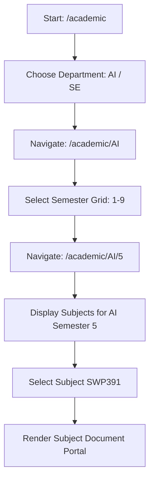

# Frontend Implementation Plan — Academic Documents (Supabase Storage)

This document provides a detailed implementation plan for the **Academic Documents** module on the frontend ([QuizzyFE](file:///c:/Users/gmt/Documents/SDN/Quizzy/QuizzyFE)). It leverages the existing NestJS backend API design and integrates **Supabase Storage** for file uploading.

---

## 1. Environment & Setup

### Supabase Credentials
Add these keys to your frontend `.env` file:

```env
NEXT_PUBLIC_SUPABASE_URL=https://qwsggozfkyxpaxcjglbj.supabase.co
NEXT_PUBLIC_SUPABASE_ANON_KEY=sb_publishable_mz6r18m22NdOphc0ekA2og_77iB1XsH
```

### Installation
Ensure the Supabase client SDK is installed in `QuizzyFE`:

```bash
npm install @supabase/supabase-js
```

### Supabase Storage Bucket Configuration
Create a **public** storage bucket in your Supabase dashboard named:
`academic-documents`

---

## 2. Supabase Client Initialization

Create the client wrapper file at `QuizzyFE/src/lib/supabase.ts`:

```typescript
// src/lib/supabase.ts
import { createClient } from '@supabase/supabase-js';

const supabaseUrl = process.env.NEXT_PUBLIC_SUPABASE_URL;
const supabaseAnonKey = process.env.NEXT_PUBLIC_SUPABASE_ANON_KEY;

if (!supabaseUrl || !supabaseAnonKey) {
  throw new Error('Missing Supabase environment variables');
}

export const supabase = createClient(supabaseUrl, supabaseAnonKey);
```

---

## 3. API Types & Interfaces

Define the academic types in `QuizzyFE/src/types/academic.type.ts` or add them to your API schema folder:

```typescript
// src/types/academic.type.ts

export interface Department {
  _id: string;
  code: 'AI' | 'SE';
  name: string;
  description?: string;
  isActive: boolean;
  createdAt: string;
  updatedAt: string;
}

export interface Subject {
  _id: string;
  code: string;
  name: string;
  departmentId: string;
  semester: number; // 1-9
  documentCount: number;
  isActive: boolean;
  createdAt: string;
  updatedAt: string;
}

export type FileType = 'pdf' | 'docx' | 'pptx' | 'xlsx' | 'other';
export type DocumentStatus = 'active' | 'archived';

export interface AcademicDocument {
  _id: string;
  title: string;
  description?: string;
  subjectId: string;
  uploadedBy: string;
  fileUrl: string;       // Supabase public URL
  fileName: string;      // original filename
  fileType: FileType;
  fileSize: number;      // in bytes
  storagePath: string;   // documents/AI/5/SWP391/timestamp_name.pdf
  status: DocumentStatus;
  downloadCount: number;
  tags: string[];
  createdAt: string;
  updatedAt: string;
}

export interface CreateDocumentDto {
  title: string;
  description?: string;
  subjectId: string;
  fileUrl: string;
  fileName: string;
  fileType: FileType;
  fileSize: number;
  storagePath: string;
  tags?: string[];
}

export interface QueryDocumentsParams {
  page?: number;
  limit?: number;
  keyword?: string;
  fileType?: FileType;
  status?: DocumentStatus | 'all';
}
```

---

## 4. API Client Integration

Create a new API service file `QuizzyFE/src/services/api/academic.api.ts` using the existing `apiClient`:

```typescript
// src/services/api/academic.api.ts
import { apiClient, ApiResponse } from './client';
import {
  Department,
  Subject,
  AcademicDocument,
  CreateDocumentDto,
  QueryDocumentsParams,
} from '@/types/academic.type';

export const academicApi = {
  // ── Departments ──
  getDepartments: () => {
    return apiClient.get<ApiResponse<Department[]>>('academic/departments');
  },

  // ── Subjects ──
  getSubjectsByDepartment: (deptId: string, semester?: number) => {
    return apiClient.get<ApiResponse<Subject[]>>(
      `academic/departments/${deptId}/subjects`,
      semester ? { semester } : undefined
    );
  },

  // ── Documents ──
  getSubjectDocuments: (subjectId: string, params: QueryDocumentsParams) => {
    return apiClient.get<ApiResponse<AcademicDocument[]>>(
      `academic/subjects/${subjectId}/documents`,
      params as any
    );
  },

  getMyDocuments: (params: QueryDocumentsParams) => {
    return apiClient.get<ApiResponse<AcademicDocument[]>>(
      'academic/documents/my',
      params as any
    );
  },

  createDocumentMetadata: (body: CreateDocumentDto) => {
    return apiClient.post<ApiResponse<AcademicDocument>>('academic/documents', body);
  },

  deleteDocument: (id: string) => {
    return apiClient.delete<ApiResponse<AcademicDocument>>(`academic/documents/${id}`);
  },

  incrementDownloadCount: (id: string) => {
    return apiClient.patch<ApiResponse<{ success: boolean }>>(
      `academic/documents/${id}/download-count`
    );
  },
};
```

---

## 5. Storage Upload Flow

### File Path Strategy
To maintain clean storage partitioning, structure uploads using the following format:
`documents/{departmentCode}/{semester}/{subjectCode}/{timestamp}_{fileName}`

### JavaScript Supabase Storage Helper
Add this helper to handle the chunked binary upload directly to the Supabase client:

```typescript
// src/lib/supabase-upload.ts
import { supabase } from './supabase';
import { FileType } from '@/types/academic.type';

export const BUCKET_NAME = 'academic-documents';

export interface UploadResult {
  fileUrl: string;
  storagePath: string;
}

export function detectFileType(fileName: string): FileType {
  const extension = fileName.split('.').pop()?.toLowerCase();
  switch (extension) {
    case 'pdf': return 'pdf';
    case 'doc':
    case 'docx': return 'docx';
    case 'ppt':
    case 'pptx': return 'pptx';
    case 'xls':
    case 'xlsx': return 'xlsx';
    default: return 'other';
  }
}

export async function uploadToSupabaseStorage(
  file: File,
  deptCode: string,
  semester: number,
  subjectCode: string
): Promise<UploadResult> {
  const timestamp = Date.now();
  const sanitizedName = file.name.replace(/[^a-zA-Z0-9.]/g, '_');
  const storagePath = `documents/${deptCode}/${semester}/${subjectCode}/${timestamp}_${sanitizedName}`;

  // 1. Upload to Supabase Storage Bucket
  const { data, error } = await supabase.storage
    .from(BUCKET_NAME)
    .upload(storagePath, file, {
      cacheControl: '3600',
      upsert: false
    });

  if (error) {
    throw new Error(`Supabase upload failed: ${error.message}`);
  }

  // 2. Get Public URLs
  const { data: urlData } = supabase.storage
    .from(BUCKET_NAME)
    .getPublicUrl(storagePath);

  return {
    fileUrl: urlData.publicUrl,
    storagePath: data.path,
  };
}
```

---

## 6. Page Layout & Component Navigation

Implement the page routing layout within `QuizzyFE/src/app/(dashboard)/academic`:

```txt
QuizzyFE/src/app/(dashboard)/academic/
|-- page.tsx                   # Major Selector Landing (AI or SE)
|-- [deptId]/
|   |-- page.tsx               # Semester Selection Grid (1 to 9)
|   `-- [semester]/
|       |-- page.tsx           # Subject Lists and Document Browse Panel
```

### Flow Walkthrough



### Component UX Details

1. **Semester Grid (1-9)**: Use Outfit typography cards, featuring a progress ring showing the number of documents uploaded across subjects.
2. **Subject List**: Renders all subjects within the selected department and semester. Show denormalized `documentCount` badges.
3. **Document Portal**:
   - Filter bar: Text Search Input + FileType dropdown (`pdf`, `docx`, `pptx`, `xlsx`, `other`).
   - List View: Clean table displaying Title, Upload Date, FileSize (formatted), and Download counter.
   - Upload Trigger: "Upload Document" button opening a beautiful drag-and-drop overlay dialog.

---

## 7. Document Upload Form (React Component Example)

```tsx
import React, { useState } from 'react';
import { useMutation, useQueryClient } from '@tanstack/react-query';
import { uploadToSupabaseStorage, detectFileType } from '@/lib/supabase-upload';
import { academicApi } from '@/services/api/academic.api';

interface UploadModalProps {
  deptCode: string;
  semester: number;
  subjectCode: string;
  subjectId: string;
  onClose: () => void;
}

export const UploadModal: React.FC<UploadModalProps> = ({
  deptCode,
  semester,
  subjectCode,
  subjectId,
  onClose,
}) => {
  const queryClient = useQueryClient();
  const [file, setFile] = useState<File | null>(null);
  const [title, setTitle] = useState('');
  const [description, setDescription] = useState('');
  const [uploadProgress, setUploadProgress] = useState<'idle' | 'uploading' | 'saving' | 'success' | 'error'>('idle');
  const [errorMessage, setErrorMessage] = useState('');

  // Mutation to call NestJS backend
  const saveMetadataMutation = useMutation({
    mutationFn: academicApi.createDocumentMetadata,
    onSuccess: () => {
      setUploadProgress('success');
      queryClient.invalidateQueries({ queryKey: ['subject-documents', subjectId] });
      setTimeout(() => onClose(), 1500);
    },
    onError: (err: any) => {
      setUploadProgress('error');
      setErrorMessage(err.message || 'Failed to save document metadata.');
    }
  });

  const handleUpload = async () => {
    if (!file || !title) return;
    try {
      setUploadProgress('uploading');
      
      // Step 1: Upload to Supabase Storage
      const { fileUrl, storagePath } = await uploadToSupabaseStorage(
        file,
        deptCode,
        semester,
        subjectCode
      );

      // Step 2: Send metadata to NestJS Backend
      setUploadProgress('saving');
      saveMetadataMutation.mutate({
        title,
        description,
        subjectId,
        fileUrl,
        fileName: file.name,
        fileType: detectFileType(file.name),
        fileSize: file.size,
        storagePath,
        tags: [],
      });
    } catch (err: any) {
      setUploadProgress('error');
      setErrorMessage(err.message || 'Upload to storage failed.');
    }
  };

  return (
    <div className="fixed inset-0 bg-black/60 backdrop-blur-sm flex items-center justify-center p-4 z-50">
      <div className="bg-slate-900 border border-slate-800 rounded-2xl w-full max-w-lg p-6 text-white shadow-2xl">
        <h3 className="text-xl font-bold mb-4 font-outfit">Upload Academic Document</h3>
        
        {uploadProgress === 'success' ? (
          <div className="py-8 text-center text-emerald-400">
            <span className="text-4xl">✓</span>
            <p className="mt-2 font-semibold">Uploaded Successfully!</p>
          </div>
        ) : (
          <div className="space-y-4">
            <div>
              <label className="text-sm font-medium text-slate-400">Document Title</label>
              <input
                type="text"
                className="w-full bg-slate-800 border border-slate-700 rounded-lg p-2.5 mt-1 focus:ring-2 focus:ring-sky-500 outline-none"
                placeholder="Enter descriptive title"
                value={title}
                onChange={e => setTitle(e.target.value)}
              />
            </div>

            <div>
              <label className="text-sm font-medium text-slate-400">Description (Optional)</label>
              <textarea
                className="w-full bg-slate-800 border border-slate-700 rounded-lg p-2.5 mt-1 focus:ring-2 focus:ring-sky-500 outline-none h-20"
                placeholder="Enter details about this document"
                value={description}
                onChange={e => setDescription(e.target.value)}
              />
            </div>

            <div className="border-2 border-dashed border-slate-700 rounded-xl p-6 text-center hover:border-sky-500 transition-colors">
              <input
                type="file"
                className="hidden"
                id="file-input"
                onChange={e => {
                  const selectedFile = e.target.files?.[0];
                  if (selectedFile) {
                    setFile(selectedFile);
                    if (!title) setTitle(selectedFile.name.split('.').slice(0, -1).join('.'));
                  }
                }}
              />
              <label htmlFor="file-input" className="cursor-pointer">
                {file ? (
                  <div className="text-sky-400 font-medium">
                    📄 {file.name} ({Math.round(file.size / 1024)} KB)
                  </div>
                ) : (
                  <div className="text-slate-400">
                    <p className="font-semibold">Click to select or drag file here</p>
                    <p className="text-xs mt-1">PDF, DOCX, PPTX, XLSX (Max 10MB)</p>
                  </div>
                )}
              </label>
            </div>

            {uploadProgress === 'error' && (
              <p className="text-rose-400 text-sm mt-2">Error: {errorMessage}</p>
            )}

            <div className="flex justify-end gap-3 mt-6">
              <button
                onClick={onClose}
                disabled={uploadProgress === 'uploading' || uploadProgress === 'saving'}
                className="px-4 py-2 bg-slate-800 hover:bg-slate-700 disabled:opacity-50 rounded-lg transition"
              >
                Cancel
              </button>
              <button
                onClick={handleUpload}
                disabled={!file || !title || uploadProgress === 'uploading' || uploadProgress === 'saving'}
                className="px-5 py-2 bg-sky-600 hover:bg-sky-500 disabled:bg-slate-800 disabled:text-slate-500 rounded-lg transition font-semibold"
              >
                {uploadProgress === 'uploading' && 'Uploading file...'}
                {uploadProgress === 'saving' && 'Saving info...'}
                {uploadProgress === 'idle' && 'Upload Document'}
              </button>
            </div>
          </div>
        )}
      </div>
    </div>
  );
};
```

---

## 8. Download Tracking Flow

When a user clicks the download icon:
1. Prevent the default immediate redirect.
2. Trigger the endpoint in the background:
   `PATCH /v1/academic/documents/:id/download-count` (does not require auth).
3. Open `fileUrl` in a new window or trigger browser file-saver download.

```typescript
const handleDownload = async (doc: AcademicDocument) => {
  try {
    // 1. Fire increment API call (fire and forget / async)
    await academicApi.incrementDownloadCount(doc._id);
  } catch (err) {
    console.error('Failed to increment download count', err);
  } finally {
    // 2. Direct user to their file
    window.open(doc.fileUrl, '_blank');
  }
};
```
